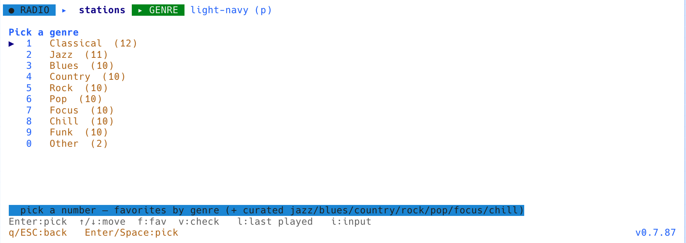

# mradio

**README · [KB (Knowledge Base)](KB.md) · [MIT license](LICENSE)** — jump straight
to anything: every key, setting, and stream is one click away.

> **A tiny terminal radio with big ears.** Live classical & jazz from curated
> streams, AI liner notes on whatever is playing, and a UI that behaves — all
> in one ~1700-line Python file with **zero dependencies**.
>
> Its header greets you as `● RADIO` — that's just the in-app badge.

<p align="center">
  
</p>

> **The complete, living knowledge base — every key, every setting, every
> stream — lives in [**KB.md**](KB.md).** This page is just the appetizer.

---

## The idea

You open a terminal, press one key, and the world's great music is playing —
Brahms from the Chicago Symphony, this minute, with a scholar's paragraph
explaining what you're hearing. No accounts. No ads. No Electron.

- **Curated, right-sized.** Your favorites are grouped by genre (Classical /
  Jazz / Blues / Country / Rock / Pop / Focus / Chill / Other) via `g`, and
  hot-picked `1-9` at all times — not a firehose of 40,000 streams.
- **Favorites that are yours.** `stations.json` is a plain file you own,
  edit, and back up. Your list, your rule.
- **AI in your corner.** Press `1` — or just watch — and mradio writes an
  intelligent liner note about the playing work via opencode, ollama, or any
  OpenAI-compatible API. The `opencode` CLI is auto-detected — install it and
  the AI lights up with zero config. No API key needed.
- **Radios that keep themselves fresh.** One file for config, cache, streams,
  and settings; a self-update that pulls the latest release in-place with `U`.

Every valve lives in the machine room: **[KB.md](KB.md) (the long read)**.

---

## In the wild

<p align="center">
  
  
  
</p>

`f` drops your favorites — one press tunes in. `g` opens a genre chooser
(Classical / Jazz / Blues / Country / Rock / Pop / Focus / Chill / Other):
your favorites grouped by genre, with curated catalogs filling those submenus
even when your favorites list is full. `k` leaps straight to this book.

---

## 30-second start

```sh
git clone https://github.com/Marcus1571/mradio.git
cd mradio
./install.sh        # -> ~/.local/bin, no root needed
mradio
```

That's it. **python3 (stdlib only) + mpv** is the whole machine room —
context in **[KB §2 — Requirements & install](KB.md#2-requirements--install)**.
*Want the AI liner notes?* Install the **opencode CLI** ([opencode.ai/download](https://opencode.ai/download)) — mradio detects it and the AI lights up on its own.

### The keys that matter

| Key | What it does |
| --- | ------------ |
| `1`-`9`, `0` | tune a favorite, instantly (`0` = slot #10; slots 11-12 via arrows) |
| `+` `=` `→` / `-` `←` | volume up / down — **work everywhere, menus included** |
| `m` | mute (remembered) — **works everywhere, menus included** |
| `v` | check for the latest release (and watch it land) |
| `l` | resume the **last-played station** (offered to the right of `v:check`) |
| `i` | **add a stream URL on the fly** — paste any http(s) URL, plays + saves as a favorite |
| `*` | **add to favorites** — on the player adds the playing station; in a genre submenu's **edit mode** adds the station under `▶` (incl. curated ones) to your `1`-`0` list. Fills the next free slot; flashes `no free slots in favorites — delete a station first` when full |
| `g` | open the **genre chooser** (favorites grouped by genre) |
| `e` | **edit mode** (favorites / genre menus): `s` selects a station to move (light-blue) then `Enter`/`Space` lands it pushing the rest down; `d` deletes the slot under `▶` (confirm, stays `— empty`, numbering never shifts). `Enter`/`Space` also plays a picked station |
| `k` | open the knowledge base |
| **Full keyboard & menus**: **[KB.md](KB.md)** |

---

## Why you're reading this

**This README is the appetizer.** The full guide —

installation for macOS / Debian / Ubuntu / Fedora / Arch & friends / WSL,
every menu, every theme, every `MRADIO_*` setting, the AI providers, the
self-update flow, and answers to "but why…?" — is one link away:

<p align="center">
  <a href="KB.md"><strong>→ Open the Knowledge Base ←</strong></a>
</p>

Terminal, but make it *cultural*.

---

*License: MIT. Author: [Marcus1571](https://github.com/Marcus1571).*